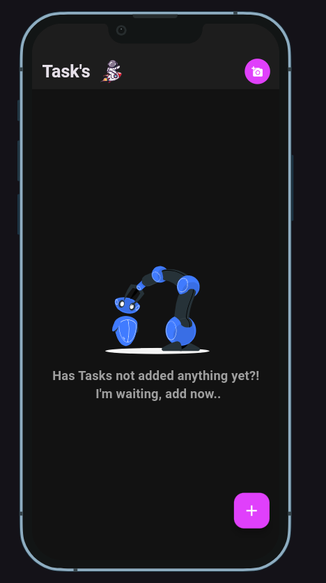
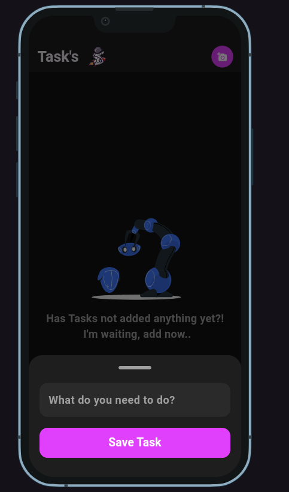
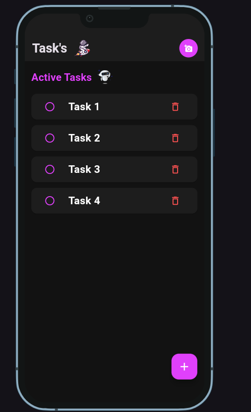
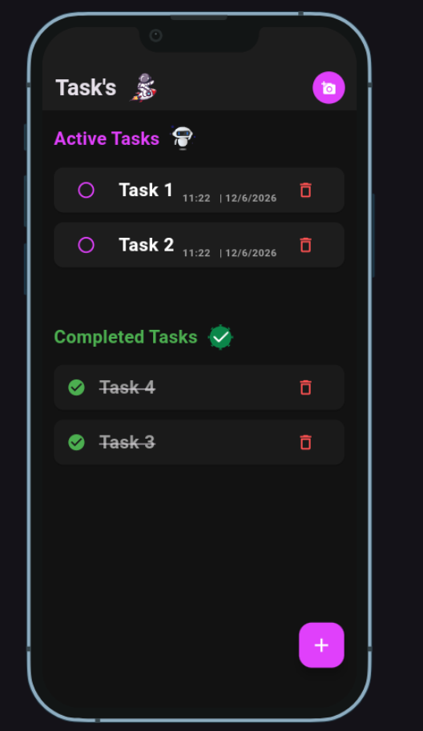
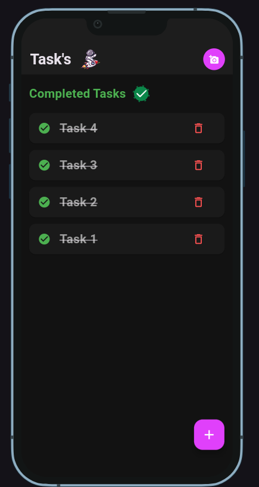

# ✅ Task's - To-Do List App (Flutter Project)
A modern Flutter UI for a simple and elegant Task Management (To-Do List) application.
This project was built to practice Flutter UI development, clean code architecture, and responsive design.
---
# 📱 App Features
The application includes:
* Home Screen with Active & Completed Tasks
* Add Task Bottom Sheet
* Mark Task as Completed
* Delete Task
* Floating Action Button for quick add
* Modern Dark UI
* Responsive Design for different screen sizes
---
# 🚀 Features
✅ Modern Dark UI Design using Flutter

✅ Clean Code Architecture
✅ Reusable Widgets
✅ Active Tasks & Completed Tasks Sections
✅ Add / Complete / Delete Tasks
✅ Responsive Design for all devices
✅ Organized project structure
✅ Smooth and simple User Experience
✅ Separation of Widgets, Constants, and Screens
✅ Beginner & Intermediate friendly project
---
# 🛠️ Technologies Used
* Flutter
* Dart
* Material Design
---
# 🎯 What I Learned
Through this project, I practiced:
* Building UI with Flutter
* Organizing Flutter projects
* Creating reusable widgets
* Managing app state (Active / Completed Tasks)
* Implementing CRUD operations (Add, Complete, Delete)
* Improving UI/UX
* Working with Bottom Sheets and Floating Action Buttons
---
# 📸 Design Inspiration
The design is a custom dark-themed Task Manager UI built and designed from scratch.
---

# 🖼️ Screenshots

  
  
  
  
  

